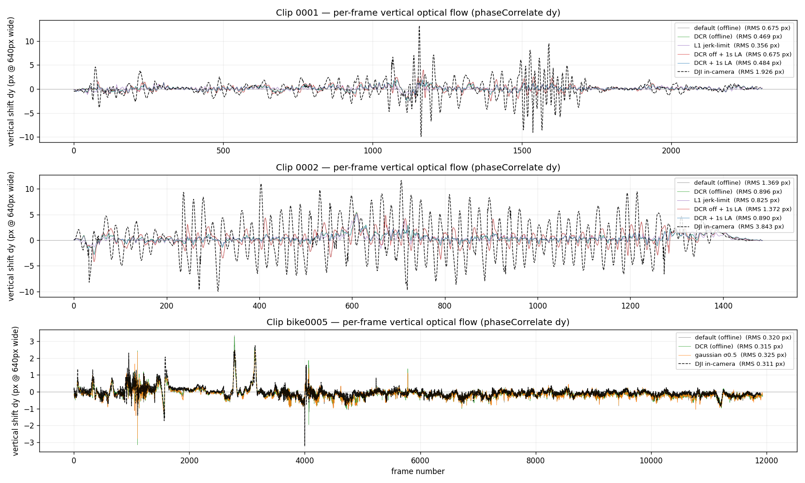
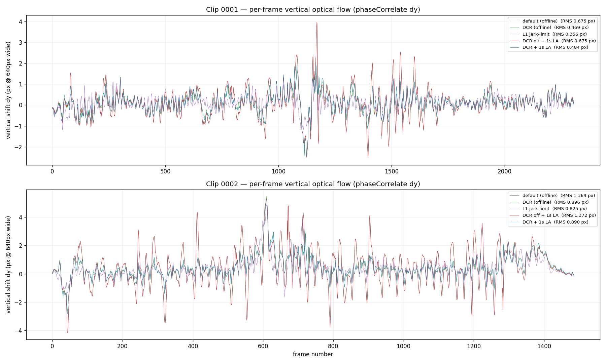
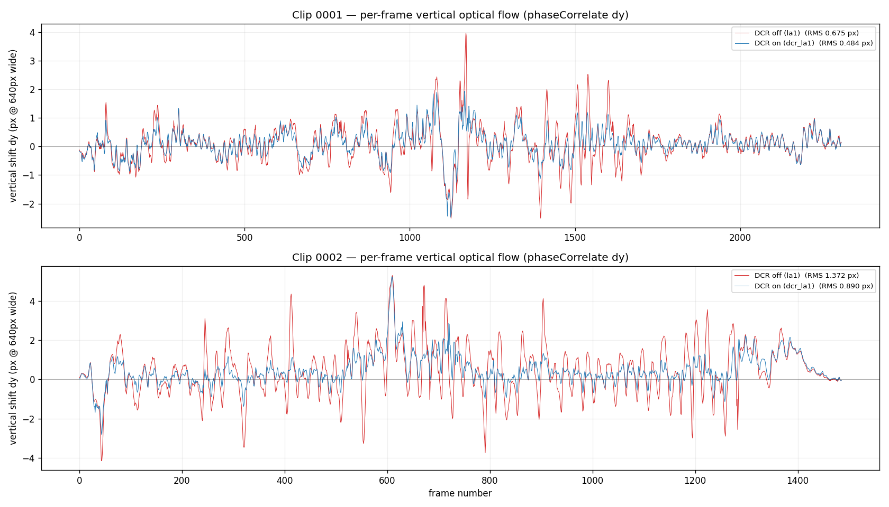
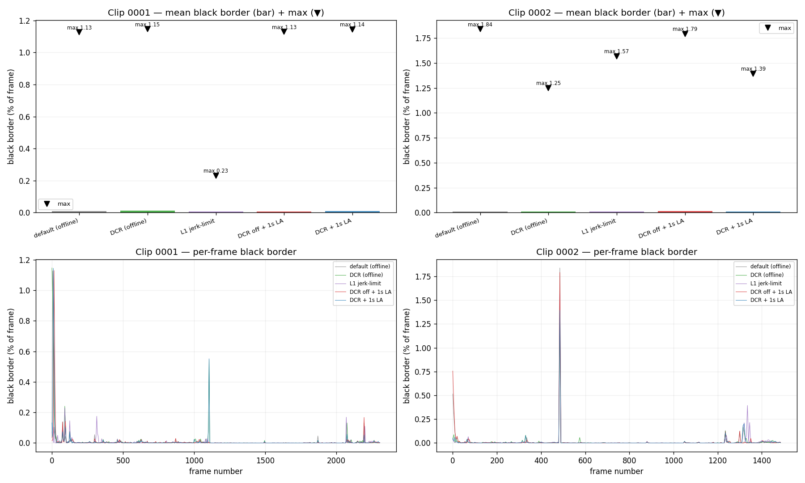
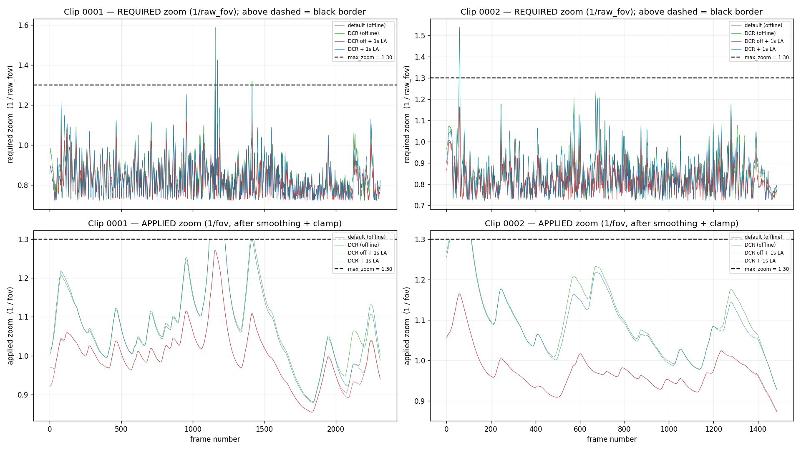

# Evaluation figures — how to reproduce

Image-domain evaluation of the smoothing/zoom configs (vertical shake, black borders,
required-vs-applied zoom). The findings and numbers are written up in
[`../SMOOTHING_RND.md` §8](../SMOOTHING_RND.md); this file is the **how-to-run** for the
three analysis scripts that produced the PNGs here.

All commands are run from the **repo root**. On a headless box prefix Python with
`MPLBACKEND=Agg`.

## What produced each figure

| figure | script | metric |
|---|---|---|
| `vertical_flow_la1_vs_dcr.png` | `tools/vertical_flow_compare.py` | per-frame global vertical shift `dy` (`cv2.phaseCorrelate`) — DCR off vs on |
| `vertical_flow_all_configs.png` | `tools/vertical_flow_compare.py` | same, all five configs overlaid |
| `vertical_flow_all_configs_vs_dji.png` | `tools/vertical_flow_compare.py` | same, plus a DJI in-camera reference clip per subplot |
| `black_border_stats.png` | `tools/black_border_stats.py` | edge-connected near-black area per frame (mean/max + time series) |
| `zoom_vs_maxzoom.png` | `tools/zoom_vs_maxzoom.py` | required zoom (`1/raw_fov`) vs applied zoom (`1/fov`) vs the `max_zoom` clamp |

The first two scripts read **rendered videos**; the third reads **validate CSVs** (no video,
much faster).

## Metric: what `phaseCorrelate dy` means

`dy` is the **per-frame global vertical shift, in pixels, between consecutive frames** of the
rendered (already-stabilized) video — a direct proxy for residual vertical shake / bob.

- **How:** `cv2.phaseCorrelate(prev, cur)` estimates the single global translation `(dx, dy)`
  that best aligns two frames, to sub-pixel precision, by comparing their phase in the frequency
  domain (FFT). We keep the vertical component `dy` and discard `dx`. A Hanning window
  (`createHanningWindow`) is applied first to suppress FFT edge effects.
- **Reading it:** a perfectly steady result has `dy ≡ 0` (the picture doesn't move frame-to-frame);
  larger `|dy|` = more vertical jitter. The **sign** is just direction (up/down). The single
  headline number per config is **`RMS dy`** over all frames — the overall vertical-shake
  magnitude; lower is steadier. This is what ranks the configs in `SMOOTHING_RND.md` §8a.
- **Units / comparability:** frames are resized to a fixed **640 px width** before correlation, so
  `dy` is in pixels *at that analysis scale* (not native 4K). The scale is identical for every
  video (square pixels, same width), so values are directly comparable across configs and across
  the 16:9 cpp renders vs the 4:3 DJI reference.
- **Scope:** phase correlation measures only *global translation* — exactly the whole-frame drift
  that camera shake produces. It does not resolve local object motion, rotation, or zoom; for
  "is the stabilized frame still bobbing as a whole?" that is the right quantity.

## Prerequisites

- Build the C++ core CLIs (`gyroflow_cpp_stabilize` needs OpenCV; `gyroflow_cpp_validate` is
  OpenCV-free):
  ```sh
  cmake -S cpp_core -B cpp_core/build -DCMAKE_BUILD_TYPE=Release
  cmake --build cpp_core/build -j
  ```
- `ffmpeg` on `PATH` (encode) and Python 3.10+ with `numpy`, `opencv-python`, `matplotlib`.
- A bridge-JSON telemetry sidecar per clip (`export_bridge_json.py`, needs a Gyroflow binary):
  ```sh
  python3 tools/export_bridge_json.py INPUT.MP4 -o cpp_out/CLIP_bridge.json
  ```

Below, `RUN` is the working dir holding the input `DJI_*_{0001,0002}_D.MP4` and a `cpp_out/`
subdir with the `{0001,0002}_bridge.json` sidecars (in this checkout:
`/media/yc/Seagate Backup Plus Drive/dji6/dji6_L/run`).

## Step 1 — render the configs (needed for the two video-domain figures)

The scripts locate renders by the exact name `cpp_out/{CLIP}_D_cpp_stabilized{SUFFIX}.mp4`.
Render each config (default 16:9 framing, envelope adaptive zoom, max_zoom 130 %):

```sh
BIN=cpp_core/build/gyroflow_cpp_stabilize
for CLIP in 0001 0002; do
  IN="$RUN"/DJI_*_${CLIP}_D.MP4
  B="$RUN/cpp_out/${CLIP}_bridge.json"
  O="$RUN/cpp_out/${CLIP}_D_cpp_stabilized"
  $BIN $IN --telemetry "$B"                    -o "${O}.mp4"          # default (offline)
  $BIN $IN --telemetry "$B" --dcr              -o "${O}_dcr.mp4"      # DCR
  $BIN $IN --telemetry "$B" --look-ahead 1     -o "${O}_la1.mp4"      # DCR off + 1 s look-ahead
  $BIN $IN --telemetry "$B" --dcr --look-ahead 1 -o "${O}_dcr_la1.mp4" # DCR + 1 s look-ahead
done
```

> **L1** (`_l1.mp4`) is produced on a different branch (`claude/speed-bump-jolt-rnd`,
> `--smoothing l1 --l1-match-default`); it is not reproducible on this branch. If the `_l1.mp4`
> files are absent the scripts just skip that config.

## Step 2 — export zoom CSVs (needed for `zoom_vs_maxzoom.png`)

`gyroflow_cpp_validate` recomputes the smoothing + adaptive zoom from the bridge JSON (no video)
and, since this branch, emits a `raw_fov` column — the per-frame **required** FOV before temporal
smoothing and the `max_zoom` clamp. The zoom script expects `cpp_out/zoom_{CLIP}_{CFG}.csv`:

```sh
VAL=cpp_core/build/gyroflow_cpp_validate
for CLIP in 0001 0002; do
  B="$RUN/cpp_out/${CLIP}_bridge.json"; Z="$RUN/cpp_out/zoom_${CLIP}"
  $VAL "$B"                    > "${Z}_default.csv"
  $VAL "$B" --dcr              > "${Z}_dcr.csv"
  $VAL "$B" --look-ahead 1     > "${Z}_la1.csv"
  $VAL "$B" --dcr --look-ahead 1 > "${Z}_dcr_la1.csv"
done
```

## Step 3 — generate the figures

```sh
CPP_OUT="$RUN/cpp_out"

# Vertical shake — all configs + DJI in-camera reference
MPLBACKEND=Agg python3 tools/vertical_flow_compare.py --dir "$CPP_OUT" --width 640 \
  -o cpp_core/figures/vertical_flow_all_configs_vs_dji.png

# Black-border statistics (stride-sampled for speed)
MPLBACKEND=Agg python3 tools/black_border_stats.py --dir "$CPP_OUT" --width 480 --stride 5 --thresh 8 \
  -o cpp_core/figures/black_border_stats.png

# Required vs applied zoom vs max_zoom clamp (reads the validate CSVs)
MPLBACKEND=Agg python3 tools/zoom_vs_maxzoom.py --dir "$CPP_OUT" --max-zoom 1.30 \
  -o cpp_core/figures/zoom_vs_maxzoom.png
```

Each script also prints a summary table to stdout (RMS `dy` per config; black-border
mean/p99/max/%frames; max required zoom + clamp-breach frame counts).

### Notes

- The DJI reference overlay is a **machine-specific hardcode** at the top of
  `main()` in `tools/vertical_flow_compare.py` (`REF_DIR` + the two `refs` paths). Edit it to
  point at your own DJI in-camera clips, or delete the `refs` dict to drop the overlay.
- `dy` is measured in pixels at the analysis width (640 px), square pixels, so values are
  comparable across the 16:9 cpp renders and the 4:3 DJI reference.
- Black borders are geometrically forced **only** where required zoom exceeds `max_zoom`
  (see `zoom_vs_maxzoom.png`); the near-black pixel counter in `black_border_stats.png`
  additionally picks up dark scene content and the thin undistort-warp edge (§8b).

## Figures

### Vertical shake — all configs vs DJI in-camera


### Vertical shake — all configs


### Vertical shake — DCR off vs on (1 s look-ahead)


### Black-border statistics


### Required vs applied zoom vs max_zoom clamp

